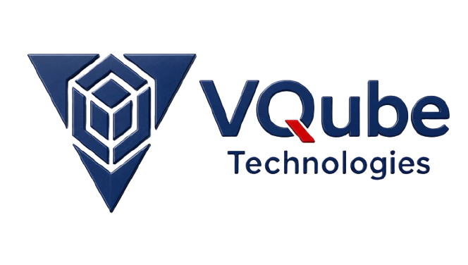

<div align="center">

<br />



<br /><br />

### Engineering Excellence & Manpower Solutions

**Vector • Vision • Value**

[](https://vqubetechnologies.com/)
[](mailto:infovqubetechnologies@gmail.com)
[](https://wa.me/917604852835?text=Hello%20VQube%20Technologies%2C%20I%20would%20like%20to%20inquire%20about%20engineering%20consulting%20services.)

<br />

</div>

## Overview

**VQube Technologies (VQT)** delivers multidisciplinary plant engineering design, numerical simulation (FEA/CFD), and global technical manpower deputation for heavy process and manufacturing industries worldwide.

---

## Bento Matrix

| Sector | Core Focus | Key Deliverables |
| :--- | :--- | :--- |
| **Cement & Mineral Processing** | Clinker lines, grinding units, pyroprocessing retrofits | FEED, GA layouts, kiln stress & thermal CFD |
| **Mining & Bulk Materials** | Beneficiation, crushing, overland conveyor networks | Structural 3D models, DEM chute wear simulation |
| **Oil & Gas / Energy** | Upstream & downstream piping, ASME pressure vessels | CAESAR II pipe stress, isometric spools, P&IDs |
| **Technical Manpower** | Global deputation of certified engineering talent | Structural, Piping, Process, QA/QC, Commissioning |

---

## Toolchain & Simulation

- **Computational Analysis**: ANSYS Fluent (CFD), ANSYS Mechanical / STAAD.Pro (FEA), Rocky DEM, CAESAR II
- **3D Plant & BIM Design**: Autodesk Plant 3D, Tekla Structures, SolidWorks, AutoCAD
- **Compliance**: ASME, ASTM, DIN, ISO, API, IS standards

---

## Repository Architecture

```text
VQube-Technologies/
├── assets/
│   └── images/              # Consolidated brand, service & gallery imagery
├── brand-kit/               # Design tokens, brand styles & metadata
├── docs/                    # Architectural specifications & DNS records
│   ├── description.md       # Master Architecture & Content Specification
│   ├── PROJECT.md           # Project Architecture & Context documentation
│   ├── context.md           # Business domain notes
│   └── zone-file-*.txt      # Production DNS zone reference
├── index.html               # Production Homepage (Apple Bento Design)
├── Contact.html             # Executive Contact & Consultation Desk
├── Term.html                # Terms & Conditions Legal Agreement
├── privacy.html             # Privacy Policy & Data Protection
├── push.bat                 # One-click Git deployment automation
├── robots.txt               # Search engine crawler directives
├── sitemap.xml              # Production XML sitemap
├── LICENSE                  # MIT License
└── GEMINI.md                # Agent directives & behavior guidelines
```

---

## Quick Start

```bash
# Clone repository
git clone https://github.com/arvindvadivelu/VQube-Technologies.git
cd VQube-Technologies

# Run locally with any static server
npx serve .
# or
python -m http.server 8000
```

---

## Contact & Headquarters

- **Headquarters**: 226/1A2, Ground Floor, Nehru Street, Alappakkam, Chengalpattu, Chennai, Tamil Nadu 603003, India
- **Head of Engineering**: Vadivelu Dhamodharan — [LinkedIn](https://www.linkedin.com/in/vadiveludhamodharan)
- **Direct Mail**: [infovqubetechnologies@gmail.com](mailto:infovqubetechnologies@gmail.com)
- **WhatsApp Direct**: [+91 76048 52835](https://wa.me/917604852835?text=Hello%20VQube%20Technologies%2C%20I%20would%20like%20to%20inquire%20about%20engineering%20consulting%20services.)

---

<div align="center">
<sub>© 2026 VQube Technologies. All rights reserved.</sub>
</div>