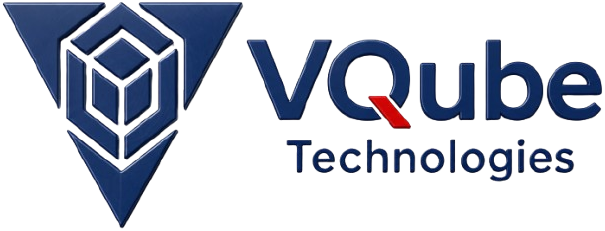

<p align="center">
  <picture>
    <source media="(prefers-color-scheme: dark)" srcset="assets/images/logo-white.png">
    <source media="(prefers-color-scheme: light)" srcset="assets/images/logo-dark.png">
    
  </picture>
</p>

<h1 align="center">VQube Technologies</h1>

<p align="center">
  <strong>Global Industrial Engineering Consulting, Numerical Simulation &amp; Skilled Technical Workforce</strong><br>
  <em>Vector &bull; Vision &bull; Value</em>
</p>

<p align="center">
  <a href="./VQube_Technologies_PRD.pdf" download>
    
  </a>
  <a href="docs/PRD_VQube_Technologies.md">
    
  </a>
  <a href="https://vqubetechnologies.com/">
    
  </a>
  <a href="https://www.linkedin.com/company/vqubetechnologies">
    
  </a>
</p>

---

## Overview

**VQube Technologies [VQT]** is an international industrial engineering consulting and technical manpower provider headquartered in Chennai, India. Backed by multi-disciplinary domain specialists with decades of EPC leadership, VQube delivers code-compliant, cost-optimized engineering solutions across the heavy process lifecycle—including **Cement**, **Mining & Minerals**, **Oil & Gas (Upstream & Downstream)**, **Power & Energy**, and **Heavy Manufacturing**.

```
Feasibility & FEED ──► Detailed Engineering ──► CFD / FEA Verification ──► Manpower Deputation ──► IFC Handover
```

---

## 📥 Product Requirements Document (PRD)

The complete engineering, operational, and digital specification for VQube Technologies is formally baselined in the **Product Requirements Document (PRD-VQT-2026-V2.4)**.

> ### 📄 **[Download VQube_Technologies_PRD.pdf (PDF, 619 KB)](./VQube_Technologies_PRD.pdf)**
> *Click above to download the executive-ready, 17-page Product Requirements Document directly.*

You can also explore alternative formats within the repository:
- **[Read PRD Markdown Specification](docs/PRD_VQube_Technologies.md)** — Full text single source of truth for Git review.
- **[View PRD Interactive HTML Source](docs/PRD_VQube_Technologies.html)** — High-resolution print-optimized layout.

| Metadata Dimension | Specification Baseline |
| :--- | :--- |
| **Document ID** | `PRD-VQT-2026-V2.4` (Approved & Baselined) |
| **Executive Sponsor** | Vadivelu Dhamodharan, Head — Engineering & Business Solutions |
| **Governing Standards** | ASME BPVC Section VIII, ASME B31.1/B31.3, API 650/620, ASTM, DIN, ISO 9001 |
| **Core Computational Stack** | ANSYS Fluent (CFD), ANSYS Mechanical (FEA), CAESAR II, AVEVA E3D, Tekla |
| **Manpower Mobilization SLA** | Rapid pre-screened deployment across 11 disciplines in **5 to 14 business days** |

---

## Core Solutions

### 1. Heavy Industrial Engineering
- **Cement Plants:** Pyroprocessing systems, rotary kiln burner aerodynamics, preheater cyclones, clinker coolers, heavy platework (process gas ducting, baghouses, transfer chutes), and structural FEA.
- **Mining & Minerals:** Crushing and screening plant layouts, beneficiation circuits, bulk transfer chutes engineered with Discrete Element Modeling (DEM), and slurry hydraulics.
- **Oil & Gas (Upstream & Downstream):** FEED packages, 3D piping routing in AVEVA E3D / AutoCAD Plant 3D, ASME Section VIII pressure vessels, and API 650/620 storage tanks.

### 2. Multi-Physics Numerical Simulation
- **Computational Fluid Dynamics (CFD):** ANSYS Fluent modeling for burner combustion, cyclone pressure-drop reduction (≥ 15% fan power savings), and dust collection dispersion.
- **Finite Element Analysis (FEA):** ANSYS Mechanical static, dynamic vibration, buckling, and thermal fatigue analysis for heavy rotating equipment and structures.
- **Pipe Stress & Flexibility:** Rigorous CAESAR II analysis calculating thermal expansion, ASME B31.1/B31.3 code compliance, and rotating equipment nozzle loads (API 610/617).

### 3. Engineering Manpower Deputation
Pre-screened engineering professionals deployed to client plant sites globally or operating from our dedicated Chennai Offshore Global Delivery Center (GDC):

- Mechanical Equipment Engineers
- Civil & Structural Design Engineers (Tekla / STAAD)
- Process & Chemical Engineers
- Piping Layout & Stress Engineers (CAESAR II)
- Electrical & Power Systems Engineers
- Instrumentation & Control (I&C) Engineers
- Project Planning & Controls Specialists (Primavera P6)
- Procurement & Technical Expeditors
- QA/QC & Welding Inspection Engineers
- HSE (Health, Safety & Environment) Specialists
- Senior CAD Designers & GA Drafters

---

## Commercial Engagement Models

| Model | Structure | Scope & Typical Deliverables | Turnaround / SLA |
| :--- | :--- | :--- | :--- |
| **Model A: Manpower Deputation** | Time & Material / Monthly Retainer | Onsite plant or Chennai Offshore GDC across 11 technical specialisms | Mobilization in 5–14 business days |
| **Model B: Fixed-Scope Turnkey EPCM** | Milestone-Based Fixed Price | Plant GA drawings, FEED packages, detailed platework drawings, BOMs | Stage-Gates: 30% / 60% / 90% / IFC |
| **Model C: Numerical Simulation** | Per-Study Lump Sum / MSA | ANSYS Fluent CFD, FEA structural verification, CAESAR II stress reports | Diagnostic reports in 7–21 business days |
| **Model D: Technical Recruitment** | Permanent Placement Fee | Specialized executive search for plant directors, chief engineers, and PMs | 90-day placement guarantee |

*Detailed commercial terms are documented in [`docs/services.md`](docs/services.md).*

---

## Digital Platform & Local Development

The repository contains the official high-performance web portal for VQube Technologies, built on native web standards with zero heavy framework runtime overhead.

- **Offline-First PWA:** Dual-strategy Service Worker (`sw.js`) delivering sub-50ms repeat loads.
- **Enterprise SEO:** Complete Schema.org JSON-LD knowledge graph for search visibility.
- **Autonomous AI Endpoints:** Compliant with the `/llms.txt` standard ([`llms.txt`](llms.txt) and [`llms-full.txt`](llms-full.txt)).

### Quickstart

Run locally using Python's built-in web server:

```bash
python -m http.server 8080
```

Open your browser at `http://localhost:8080`.

---

## Corporate Advisory & Contact

- **Global Delivery Center:** Chennai, Tamil Nadu 600015, India
- **Executive Leadership:** Vadivelu Dhamodharan, Head — Engineering & Business Solutions
- **Email:** [infovqubetechnologies@gmail.com](mailto:infovqubetechnologies@gmail.com)
- **Direct Phone / WhatsApp:** [+91 76048 52835](https://wa.me/917604852835)
- **Direct Advisory Desk:** [pages/Contact.html](pages/Contact.html)
- **Legal & Governance:** [Terms of Service](pages/Term.html) &bull; [Privacy Policy](pages/Privacy.html)

---

<p align="center">
  &copy; 2026 <strong>VQube Technologies</strong>. All rights reserved.<br>
  <em>Vector &bull; Vision &bull; Value</em>
</p>
