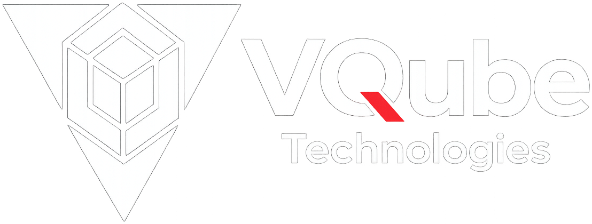
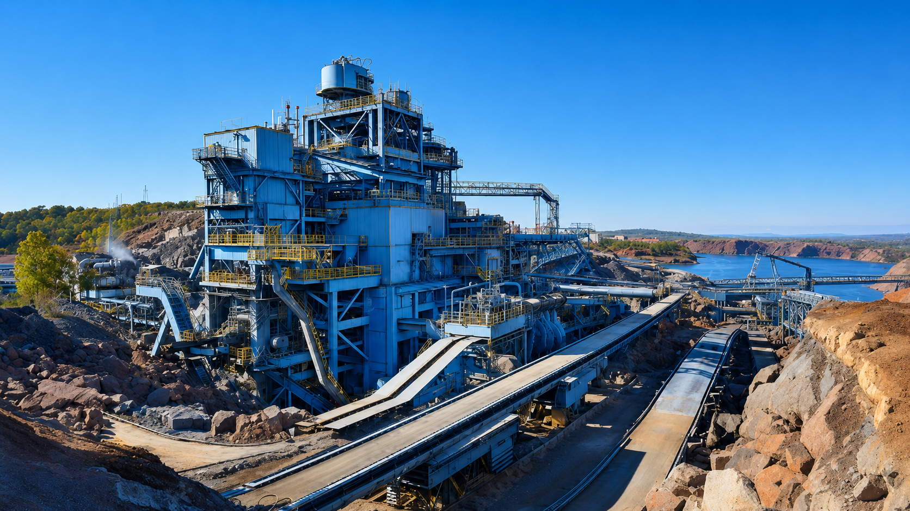
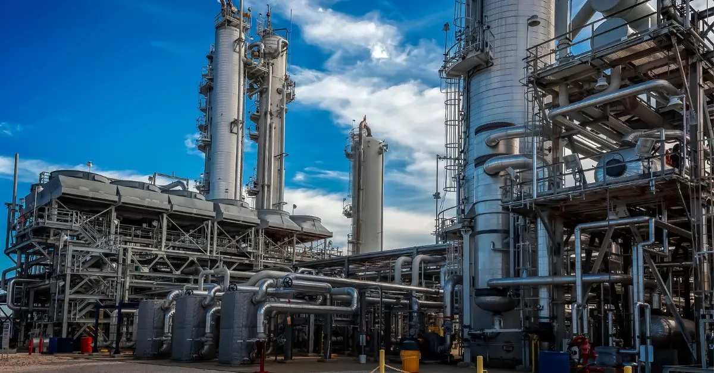
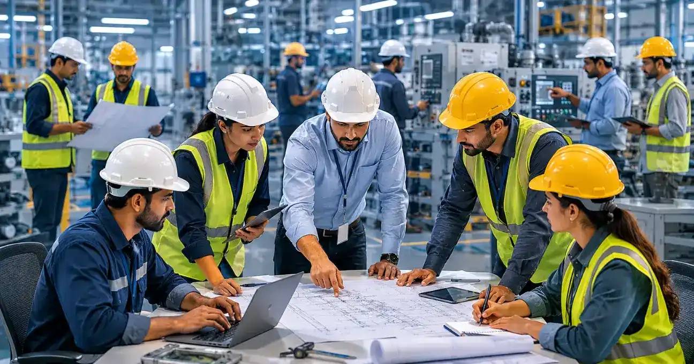
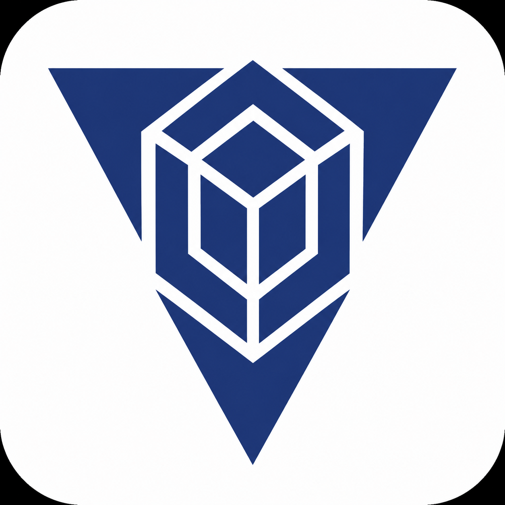

<p align="center">
  <a href="https://vqubetechnologies.com/" target="_blank" rel="noopener noreferrer">
    
  </a>
</p>

<h1 align="center">VQube Technologies (VQT)</h1>

<p align="center">
  <strong>Global Industrial Engineering Consulting, Numerical Simulation & Skilled Manpower Solutions</strong><br>
  <em>Vector &bull; Vision &bull; Value</em>
</p>

<p align="center">
  <a href="https://vqubetechnologies.com/"></a>
  <a href="https://www.linkedin.com/company/vqubetechnologies"></a>
  <a href="mailto:infovqubetechnologies@gmail.com"></a>
</p>

<p align="center">
  
  
  
  
  
  
</p>

---

## 📑 Table of Contents

- [Executive Overview](#-executive-overview)
- [Trust Metrics & Global Footprint](#-trust-metrics--global-footprint)
- [Industry Solutions & Focus Areas](#-industry-solutions--focus-areas)
  - [1. Cement Industry Engineering](#1-cement-industry-engineering)
  - [2. Mining & Mineral Processing](#2-mining--mineral-processing)
  - [3. Oil & Gas (Upstream & Downstream)](#3-oil--gas-upstream--downstream)
  - [4. Engineering Manpower Deputation & Recruitment](#4-engineering-manpower-deputation--recruitment)
- [Advanced Computational Toolchain & Standards](#-advanced-computational-toolchain--standards)
- [Commercial Engagement Models](#-commercial-engagement-models)
- [Repository & Web Platform Architecture](#-repository--web-platform-architecture)
- [Directory Structure](#-directory-structure)
- [Local Development & Deployment Guide](#-local-development--deployment-guide)
- [Client Endorsements & Technical Leadership](#-client-endorsements--technical-leadership)
- [Corporate Advisory & Global Headquarters](#-corporate-advisory--global-headquarters)
- [Legal, Governance & License](#-legal-governance--license)

---

## 🏢 Executive Overview

**VQube Technologies [VQT]** is an internationally operating engineering consultancy and technical workforce provider headquartered in Chennai, Tamil Nadu, India. Backed by multi-disciplinary domain specialists with decades of EPC project leadership, VQube delivers technically sound, cost-effective, and sustainable solutions across the entire engineering value chain.

We support plant operators, engineering contractors, and technology suppliers across heavy manufacturing sectors—including **Cement**, **Mining & Minerals**, **Oil & Gas**, **Power & Energy**, and **Industrial Manufacturing**—transforming complex capital investment concepts into high-performing, code-compliant operating assets.

```
       Feasibility & FEED ──► Detailed Engineering ──► CFD / FEA Verification
                                                              │
                                                              ▼
Operational Excellence ◄── Commissioning & QA/QC ◄── Manpower Deputation
```

---

## 📊 Trust Metrics & Global Footprint

<div align="center">

| Metric | Target / Achievement | Operational Context |
| :---: | :---: | :--- |
| **50+** | Delivered Projects Worldwide | Greenfield & Brownfield plant design, ductwork, and structural verification |
| **15+** | Global Enterprise Clients | Serving tier-1 EPC contractors, equipment OEMs, and plant owners |
| **100%** | Code-Compliant Engineering | Complete lifecycle compliance with ASME, ASTM, DIN, ISO, and API codes |
| **24/7** | Technical Deputation & Advisory | Multi-disciplinary engineering teams mobilized across 11 technical specialisms |

</div>

---

## 🏭 Industry Solutions & Focus Areas

<table align="center" width="100%">
  <tr>
    <td align="center" width="50%">
      <br>
      <strong>Cement Plant Engineering</strong>
    </td>
    <td align="center" width="50%">
      <br>
      <strong>Mining & Mineral Processing</strong>
    </td>
  </tr>
  <tr>
    <td align="center" width="50%">
      <br>
      <strong>Oil & Gas (Upstream & Downstream)</strong>
    </td>
    <td align="center" width="50%">
      <br>
      <strong>Skilled Manpower Deputation & Recruitment</strong>
    </td>
  </tr>
</table>

### 1. Cement Industry Engineering
End-to-end design and optimization for pyroporocessing, grinding, and material handling systems:
- **Project Engineering**: Feasibility studies, Techno-Economic Assessments, Conceptual Engineering, and Front-End Engineering Design (FEED).
- **Plant Layout & General Arrangement (GA)**: Complete 3D layout development, equipment lists, and technical datasheets.
- **Heavy Platework Engineering**: Process gas ducting, transfer chutes, dedusting ductwork, baghouse layouts, cyclones, and transition hoppers.
- **CFD Aerodynamic Optimization**: Rotary kiln burner aerodynamics, calciner combustion modeling, cyclone preheater thermal flow, clinker cooler aeration, and separator efficiency.
- **Structural FEA**: Static and dynamic verification of rotary kiln components, ball mill foundations, stacker reclaimers, silos, and conveyor galleries.

### 2. Mining & Mineral Processing
High-efficiency designs engineered to resist abrasion, material wear, and hydrodynamic stress:
- **Plant Layout & Flow Development**: Crushing stations, screening buildings, beneficiation circuits, and stockpile handling systems.
- **Material Handling Platework**: Bulk transfer chutes engineered via Discrete Element Modeling (DEM) to minimize material degradation and impact wear.
- **Mine Ventilation & Dedusting CFD**: Airflow dynamics through tunnels, transfer points, crushing circuits, and pneumatic transport lines.
- **Hydraulic & Slurry Analysis**: Hydrocyclone separation dynamics, tailings slurry transport, and piping hydraulic head loss evaluations.
- **Structural Integrity**: Dynamic vibration and fatigue analysis on vibrating screens, crushers, and heavy storage bins.

### 3. Oil & Gas (Upstream & Downstream)
Robust engineering for high-pressure, high-temperature, and hazardous industrial environments:
- **Upstream Engineering**: Concept development, mechanical equipment design, modular skids, and process simulation.
- **Downstream Refining & Petrochemicals**: FEED packages, 3D piping routing in AVEVA E3D / AutoCAD Plant 3D, and civil/structural packages.
- **Pipe Stress & Flexibility Analysis**: Rigorous CAESAR II modeling calculating thermal expansion, code stress compliance (ASME B31.3), nozzle loading on pumps/turbines, and spring support schedules.
- **Equipment Design**: Pressure vessels (ASME Section VIII Div 1 & 2), storage tanks (API 650/620), and heat exchanger nozzle validation.

### 4. Engineering Manpower Deputation & Recruitment
Rapid deployment of specialized, pre-screened technical talent worldwide across **11 key engineering disciplines**:

```
 ┌────────────────────────────────────────────────────────────────────────┐
 │                   11 ENGINEERING DISCIPLINES COVERED                   │
 ├────────────────────────────┬───────────────────────────────────────────┤
 │ 01. Mechanical Engineering │ 07. Project Planning & Controls (P6)      │
 │ 02. Civil & Structural     │ 08. Procurement & Expediting              │
 │ 03. Process Engineering    │ 09. QA/QC & Welding Inspection            │
 │ 04. Piping Engineering     │ 10. HSE (Health, Safety & Environment)    │
 │ 05. Electrical Engineering │ 11. Senior CAD Designers & GA Drafters    │
 │ 06. Instrumentation & Control (I&C)                                    │
 └────────────────────────────┴───────────────────────────────────────────┘
```

- **Deployment Modalities**: Onsite client plant deputation (greenfield or brownfield), Dedicated Offshore Engineering Center (Chennai Global Delivery Center), or hybrid augmentation.
- **Mobilization Timeline**: Standard talent onboarding within 5 to 14 business days.
- **Permanent Placement**: Executive search and specialized technical recruitment for licensed plant heads, chief engineers, and project leads.

---

## 🔬 Advanced Computational Toolchain & Standards

### Numerical Simulation Matrix
We eliminate thermal stress failures, vibration resonance, and aerodynamic bottlenecks prior to fabrication:

| Discipline | Computational Software | Focus Scenarios & Engineering Deliverables |
| :--- | :--- | :--- |
| **Computational Fluid Dynamics (CFD)** | ANSYS Fluent | Kiln combustion, cyclone separation, clinker cooler aeration, aerodynamic pressure-drop minimization, dust dispersion |
| **Finite Element Analysis (FEA)** | ANSYS Mechanical | Static structural, modal & dynamic vibration, thermal fatigue, buckling stability, equipment durability verification |
| **Piping Stress Analysis** | CAESAR II | Thermal growth calculation, nozzle load compliance, pipe hanger sizing, ASME B31.1/B31.3 qualification |
| **Plant & 3D Modeling** | AVEVA E3D, Plant 3D, SolidWorks | 3D multi-discipline plant models, clash resolution, equipment modeling, piping isometrics |
| **Structural Detailing** | Tekla Structures, AutoCAD | General Arrangement (GA) drawings, steel fabrication drawings, platework fabrication detailing |

### Governing International Codes & Standards
All engineering deliverables strictly adhere to international statutory bodies:
- **Boilers & Pressure Vessels**: ASME BPVC Section VIII (Div 1 & Div 2)
- **Piping Systems**: ASME B31.1 (Power Piping), ASME B31.3 (Process Piping)
- **Atmospheric Storage Tanks**: API 650, API 620
- **Materials & Testing**: ASTM International
- **Structural Design**: DIN, Eurocodes, AISC, IS Standards
- **Quality Management**: ISO 9001 aligned lifecycle delivery

---

## 💼 Commercial Engagement Models

VQube Technologies provides flexible commercial arrangements tailored to project lifecycle requirements (detailed in [`docs/services.md`](file:///c:/Users/DELL/OneDrive/Desktop/VQube%20Technologies/docs/services.md)):

```
┌────────────────────────────────────────────────────────────────────────┐
│                      COMMERCIAL ENGAGEMENT MODELS                      │
├───────────────────────────────────┬────────────────────────────────────┤
│ Model A: Manpower Deputation      │ Model B: Fixed-Scope Turnkey EPCM  │
│ - Structure: T&M / Monthly        │ - Structure: Milestone Fixed Price │
│ - Scope: Onsite or Offshore GDC   │ - Gates: 30% / 60% / 90% / IFC     │
├───────────────────────────────────┼────────────────────────────────────┤
│ Model C: Numerical Simulation     │ Model D: Technical Recruitment     │
│ - Structure: Per-study / MSA      │ - Structure: Placement / Retained  │
│ - Turnaround: 7 to 21 business days│ - Scope: Executive & Lead Engineers│
└───────────────────────────────────┴────────────────────────────────────┘
```

---

## 💻 Repository & Web Platform Architecture

The repository serves both as the corporate technical portfolio and the digital client interface for VQube Technologies. Designed for ultra-high speed, enterprise accessibility, and search engine dominance.

### Architecture Highlights
- **Core Technology**: Native Semantic HTML5, Modular Vanilla CSS3, and ES6+ JavaScript (zero heavy framework runtime overhead).
- **Design Aesthetic**: Minimalist warm monochrome palette (`#FAF6F2`, `#162B49`, `#111111`), custom typography via Adobe Typekit & Google Fonts (`sizmo`, `Geist`, `Newsreader`), fluid layout containers, and subtle micro-animations.
- **PWA Service Worker (`sw.js`)**: Implements dual caching strategy (Cache-First for static assets, Stale-While-Revalidate for HTML), providing sub-50ms repeat page loads and seamless offline resilience.
- **Enterprise SEO & Structured Data**: Complete Schema.org JSON-LD graph (`Organization`, `WebSite`, `FAQPage`, `Person`) enabling Google rich snippets and knowledge graph indexing.
- **Autonomous AI Evaluation Endpoints**: Includes [`llms.txt`](file:///c:/Users/DELL/OneDrive/Desktop/VQube%20Technologies/llms.txt) and [`llms-full.txt`](file:///c:/Users/DELL/OneDrive/Desktop/VQube%20Technologies/llms-full.txt) following the /llms.txt specification for AI assistants and autonomous procurement agents.

```mermaid
graph TD
    Client[Browser / Client Device] --> |HTTPS Request| SW[Service Worker sw.js]
    SW --> |Cache-First Hit| Cache[(Cache Storage vqube-perf-v3)]
    SW --> |Stale-While-Revalidate| Network[Origin Server]
    
    subgraph Frontend Pages
        Index[index.html - Corporate Portal]
        Contact[pages/Contact.html - Executive Advisory]
        Term[pages/Term.html - Terms & Conditions]
        Privacy[pages/Privacy.html - Privacy Governance]
    end
    
    subgraph Machine Intelligence
        LLMS[llms.txt - Summary Endpoint]
        LLMSFull[llms-full.txt - Full Context Bundle]
        ServicesMD[docs/services.md - Engagement Matrix]
    end
    
    Index --> Frontend Pages
```

---

## 📁 Directory Structure

```text
VQube Technologies/
├── assets/
│   ├── css/
│   │   ├── style.css                             # Core design tokens, typography & layout styles
│   │   └── live_styles.css                       # Production fallback stylesheet
│   ├── js/
│   │   └── script.js                             # Header dynamics, drawer menu, modal forms & FAQ
│   ├── images/
│   │   ├── logo-white.png                        # Primary corporate white brandmark
│   │   ├── logo-dark.png                         # Dark brandmark
│   │   ├── favicon.png                           # Web and Apple touch icon
│   │   ├── CEMENTPLANT.png                       # Cement plant engineering showcase
│   │   ├── MINE.png                              # Mining & mineral processing showcase
│   │   ├── OIL.png                               # Upstream & downstream oil & gas showcase
│   │   ├── MANPOWER.png                          # Engineering workforce deputation showcase
│   │   ├── Photo Frame.jpeg                      # Corporate visual asset
│   │   ├── QR.png                                # Advisory connect QR asset
│   │   └── 1.jpeg - 4.jpeg                       # Plant engineering visual gallery assets
│   ├── site_images/                              # Specialized UI graphics and thumbs
│   ├── videos/                                   # High-definition process & project footage
│   ├── linesBackground.svg                       # Engineering grid decorative vector
│   └── logo_full.html                            # Standalone vector logo preview
├── docs/
│   ├── description.md                            # Master website content & copy specification
│   └── services.md                               # Commercial engagement models & services matrix
├── pages/
│   ├── Contact.html                              # Executive contact & consultation booking
│   ├── Privacy.html                              # Privacy governance & GDPR policy
│   └── Term.html                                 # Terms & Conditions, legal jurisdiction
├── index.html                                    # Main corporate portal & services portfolio
├── llms.txt                                      # Autonomous LLM / AI agent summary context
├── llms-full.txt                                 # Full uncompressed LLM context repository
├── README.md                                     # Enterprise repository documentation
├── robots.txt                                    # Crawler directives & search engine indexing
├── sitemap.xml                                   # XML sitemap for search engine crawlers
└── sw.js                                         # Progressive Web App offline caching engine
```

---

## 🚀 Local Development & Deployment Guide

### Prerequisites
Because the platform is engineered with zero-dependency native web standards, no compilation or bundler toolchain (Webpack/Vite/npm) is strictly required to run or test the site.

### Running Locally

#### Option 1: Python HTTP Server (Recommended)
```bash
# Python 3.x
python -m http.server 8080

# Access in browser at: http://localhost:8080
```

#### Option 2: Node.js `serve` or `live-server`
```bash
# Using npx (no permanent installation required)
npx -y serve . -p 8080

# Or with live reloading:
npx -y live-server --port=8080
```

#### Option 3: VS Code / Cursor IDE Extension
Right-click on `index.html` and choose **"Open with Live Server"**.

### Verifying Service Worker & PWA Caching
1. Open DevTools in Google Chrome or Microsoft Edge (`F12` or `Ctrl+Shift+I`).
2. Navigate to **Application > Service Workers**.
3. Confirm `sw.js` is registered with status **Activated and is running**.
4. Check **Application > Cache Storage > vqube-perf-v2** to inspect cached static assets.
5. In the Network panel, toggle **Offline** mode to verify full offline accessibility.

---

## 👥 Client Endorsements & Technical Leadership

### Technical Advisory
VQube Technologies is guided by senior engineering leaders with decades of multi-disciplinary EPC project experience across heavy process, cement, and manufacturing industries—directing high-fidelity FEA/CFD modeling initiatives, plant layout engineering, and global technical deputation programs.

### Client Endorsements

> *"Highly dedicated & hardworking, with in-depth functional knowledge in Cement Plant Systems. Displays strong ownership of project deliverables and collaborates well to achieve outstanding results. Always meets commitments and earns trust."*  
> &mdash; **Senior General Manager**, *Managing Engineering of Greenfield Cement Project*

> *"One of the rarest and best project engineering specialists, particularly in plant layout and industrial process design. Contributions consistently add substantial value to complex capital projects."*  
> &mdash; **Senior Project Manager**, *Carbon Upcycling Technologies*

> *"Expertise in plant engineering and system engineering solutions is truly outstanding. With a meticulous approach to work, ensuring every detail is accounted for with zero room for error. Highly recommended for technical excellence and dedication to project delivery."*  
> &mdash; **Senior Project Manager**, *Bridge Gap Engineering*

---

## 🏢 Corporate Advisory & Global Headquarters

<table align="center" width="100%">
  <tr>
    <td width="25%" align="center">
      <br>
      <strong>VQube Technologies</strong>
    </td>
    <td width="75%">
      <p>
        📍 <strong>Global Headquarters</strong>: Chennai, Tamil Nadu 600015, India<br>
        🗺️ <strong>Map Coordinates</strong>: <a href="https://maps.app.goo.gl/tafZc8eqjrF6T3b89">Google Maps Navigation</a><br>
        ✉️ <strong>Corporate Inquiries</strong>: <a href="mailto:infovqubetechnologies@gmail.com">infovqubetechnologies@gmail.com</a><br>
        🌐 <strong>Official Website</strong>: <a href="https://vqubetechnologies.com/">https://vqubetechnologies.com/</a><br>
        💼 <strong>LinkedIn Page</strong>: <a href="https://www.linkedin.com/company/vqubetechnologies">linkedin.com/company/vqubetechnologies</a><br>
        📋 <strong>Consultation &amp; Scopes</strong>: <a href="pages/Contact.html">Direct Advisory Desk &amp; Inquiry Form</a>
      </p>
    </td>
  </tr>
</table>

---

## ⚖️ Legal, Governance & License

- **Intellectual Property**: All CAD models, computational setups, 3D renderings, brand marks, and technical specifications are the proprietary intellectual property of VQube Technologies or protected under executed commercial Statements of Work (SOW).
- **Commercial Inquiries & Proposals**: Engineering estimates, quotations, and manpower scopes are provided pursuant to our official [`docs/services.md`](file:///c:/Users/DELL/OneDrive/Desktop/VQube%20Technologies/docs/services.md) framework and formal NDAs.
- **Terms of Service**: Detailed in [`pages/Term.html`](file:///c:/Users/DELL/OneDrive/Desktop/VQube%20Technologies/pages/Term.html).
- **Privacy Policy**: Full privacy and data governance details in [`pages/Privacy.html`](file:///c:/Users/DELL/OneDrive/Desktop/VQube%20Technologies/pages/Privacy.html).

<p align="center">
  &copy; 2026 <strong>VQube Technologies</strong>. All rights reserved.<br>
  <em>Vector &bull; Vision &bull; Value</em>
</p>
